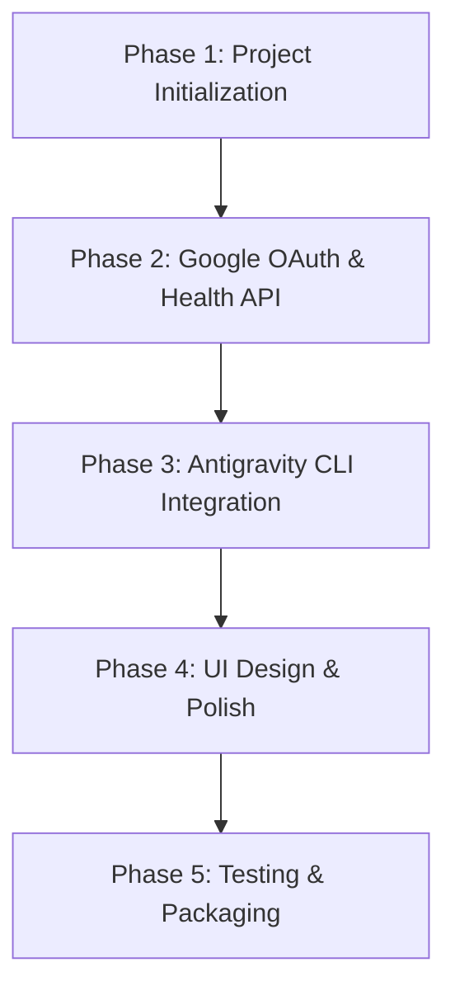

# Project Specification: Gem (Personal Life OS & Antigravity Assistant)

Gem is an all-in-one desktop application designed for Windows and Linux. It acts as a comprehensive Life Dashboard that integrates Google Health data and hosts a chat interface powered by the Google Antigravity (AGY) CLI.

---

## 1. Project Architecture

### Frontend (Flutter/Dart)
- **Target Platforms:** Windows & Linux (Desktop).
- **Design System:** Glassmorphism UI theme. Featuring a modern, translucent dark-mode look, smooth micro-animations, soft shadows, background blur filters, and vibrant color gradients.
- **State Management:** Riverpod (`flutter_riverpod`) for reactive state, dependency injection, and management of asynchronous Google API/CLI operations.
- **Database:** Drift (SQLite) or a local JSON file caching system for offline data storage and user settings.

### Integrations & Decisions
- **Google OAuth 2.0 & APIs:** 
  - Standard desktop OAuth 2.0 loopback server.
  - Uses a local `config.json` placeholder file where users can populate their `client_id` and `client_secret`.
  - Integrates with the Google Fit REST API for fetching steps, sleep, and heart rate.
- **Antigravity CLI Wrapper:**
  - Standard chat UI mapping to the local `agy` executable.
  - Resolves `agy` path dynamically from the system `PATH`, with an options page field to manually override the path.
  - Intercepts commands, manages working directory context, and streams terminal outputs.
  - **Process Tree Monitoring:** Monitors active subagents by reading and parsing the JSONL transcript logs generated under the Antigravity application directory (`~/.gemini/antigravity-cli/brain/`).

---

## 2. Key Features & Interface Design

### Dashboard (Life Center)
- **Overview Grid:** Dynamic cards displaying real-time metrics.
- **Health Widget:** Detailed line charts and progress rings for daily step goals, sleep tracking, and heart rate history.
- **Calendar & Tasks:** Synchronized calendar entries and local to-do lists.

### Antigravity Assistant Chat
- **Chat Interface:** Familiar conversational bubble design with syntax highlighting for code blocks.
- **Multimodal Inputs:** Support for drag-and-drop or file selector to attach files, source code files, or images. Attachments are saved to the workspace/scratch directory and automatically referenced in the prompt.
- **Command Executor:** Under-the-hood process executor that forwards user prompts to `agy` and shows system execution steps.
- **File Explorer Linkage:** Visual shortcuts to files modified or inspected by the assistant during tasks.
- **Agent Process Tree & Activity Monitor:**
  - An interactive visual tree graph depicting the orchestrator agent and any spawned subagents.
  - Real-time status indicators (Thinking, Running Command, Completed, Failed) and live terminal logs for each node.

---

## 3. Implementation Plan

### Phase 1: Project Initialization & Setup
- Initialize Flutter project with desktop configuration.
- Set up project structure (Clean Architecture: Data, Domain, Presentation).
- Configure window management (`window_manager`) for sleek window borders and controls.

### Phase 2: Google OAuth & Health API
- Implement Google OAuth 2.0 flow using standard desktop redirect (loopback receiver).
- Establish connection to Google Fit REST API.
- Create data models for steps, sleep, and heart rate.
- Implement caching mechanism.

### Phase 3: Antigravity CLI Integration
- Design the Process Wrapper to launch, monitor, and send input to `agy` CLI processes.
- Implement the Chat UI (message list, input field, code highlighting).
- Enable interactive workspace commands.

### Phase 4: UI/UX & High Aesthetics
- Design dashboard layout with custom widgets.
- Add micro-animations (e.g., hover states, slide-in panels, fading charts).
- Ensure consistent color tokens (HSL-based dark mode theme).

### Phase 5: Verification & Production Build
- Conduct unit and widget tests.
- Verify cross-platform functionality on Linux and Windows.
- Build production binaries.

---

## 4. Definition of Done (MVP)
1. Flutter desktop application launches successfully on both Linux and Windows.
2. User can log in via Google OAuth and see their Google Fit metrics populated on the dashboard.
3. Chatbot interface successfully starts the `agy` CLI, executes commands, and displays outputs.
4. UI utilizes a modern, dark-mode design system with no default placeholders.
