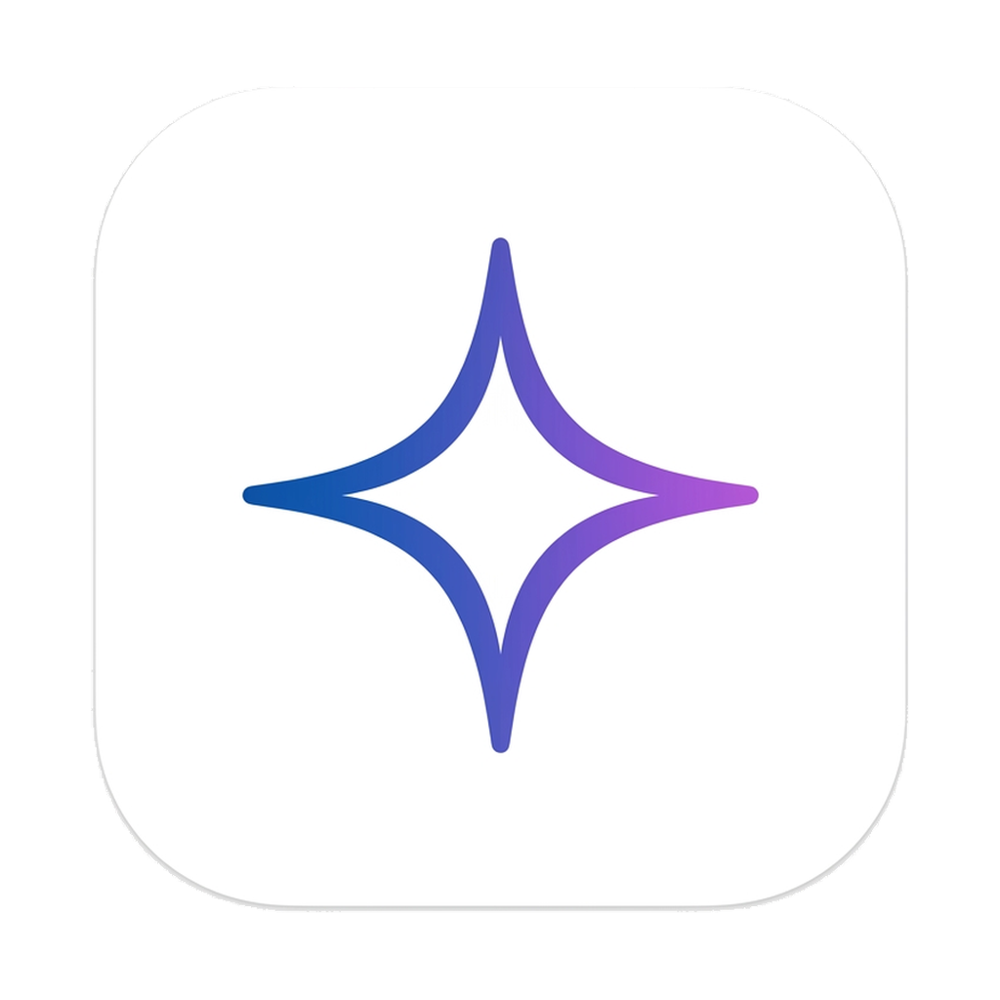

# Gem (Personal Life OS & Antigravity Assistant)

Gem is a Flutter-based desktop application designed for Windows and Linux that acts as a Personal Life OS and a frontend interface for the Antigravity (`agy`) agentic system. It features a modern, visually stunning glassmorphic UI, real-time health data synchronization, interactive process tree rendering, and terminal/chat integrations.



## Features

- **Visually Stunning Glassmorphic UI**: Uses custom themes, glowing gradients with transparency, and modern typography to deliver a premium user experience.
- **Google OAuth 2.0 & Fit REST API Integration**: Performs a desktop loopback OAuth flow to sync and locally cache metrics like steps, sleep, heart rate, and calories.
- **Process Wrapper & CLI Integration**: Integrates directly with the `agy` command-line tool. Start, stop, and send interactive inputs to subprocesses in real-time.
- **Subagent Node Visualizer**: Monitors `~/.gemini/antigravity-cli/brain/*.jsonl` transcripts dynamically to render an interactive node tree of active subagents and their states.

## Architecture

Gem follows the principles of Clean Architecture:
- **Presentation Layer**: Riverpod state management, custom-drawn charts, node tree visualizer, and a chat window interface.
- **Domain Layer**: Core entity definitions (`HealthMetric`, `SubagentNode`, `ProcessState`) and repository interfaces.
- **Data Layer**: Processes handling, JSONL file monitoring (`BrainMonitor`), OAuth loopback service, local caching repositories, and API clients.

## File Structure

```
lib/
├── main.dart             # Application entry point & window management setup
├── core/                 # Shared styling themes, decorations, and constants
├── data/
│   ├── models/           # JSON parsers for Fit metrics, App configs, and JSONL transcripts
│   ├── repositories/     # SQLite local caching, CLI Process execution, and directory scanning
│   └── services/         # OAuth 2.0 loopback servers and REST clients
├── domain/
│   ├── entities/         # Data structures (Health metrics, agent nodes)
│   └── repositories/     # Interface definitions
└── presentation/
    ├── providers/        # Riverpod providers (Auth status, health metrics history, process monitoring)
    └── widgets/          # Custom widgets (DashboardView, Glassmorphic headers, Line charts, Node graphs)
```

## Getting Started

### Prerequisites

- Flutter SDK (version `^3.12.0` or higher)
- Visual Studio (with C++ Desktop development workload) for Windows, or build tools (`clang`, `cmake`, `ninja`, `pkg-config`) for Linux.
- An `agy` CLI installed on your path or configured in the app settings.
- A `config.json` containing Google OAuth credentials placed at the root of the project:
  ```json
  {
    "client_id": "YOUR_CLIENT_ID.apps.googleusercontent.com",
    "client_secret": "YOUR_CLIENT_SECRET",
    "auth_uri": "https://accounts.google.com/o/oauth2/auth",
    "token_uri": "https://oauth2.googleapis.com/token"
  }
  ```

### Build & Run Instructions

#### Running the application locally:
```bash
# Run in development mode
flutter run -d windows  # For Windows
flutter run -d linux    # For Linux
```

#### Running the tests:
```bash
# Run all unit, widget, and E2E tests
flutter test
```

## Windows & Linux Executable Configuration

- **App Icon**: The application uses `icon.png` (converted to `windows/runner/resources/app_icon.ico` for the native Windows taskbar and application window).
- **Frameless Window**: Custom custom chrome handles minimizing, maximizing, closing, and window dragging seamlessly across both Windows and Linux platforms.
