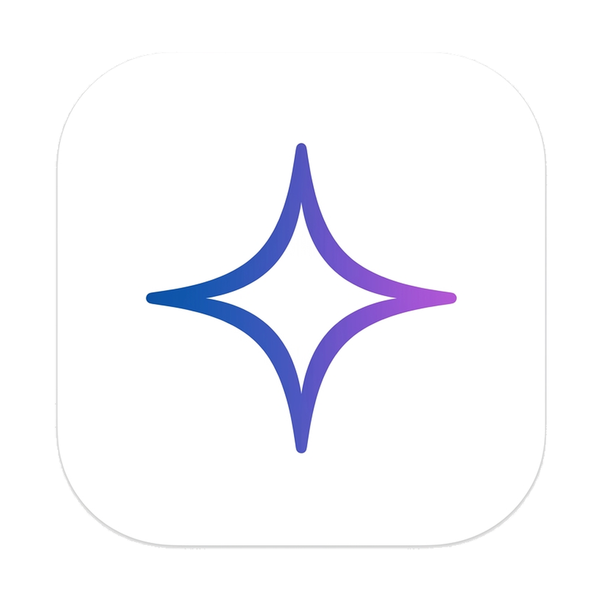

# Gem

A minimal, lightweight, and native desktop client wrapper for Google Gemini. Designed to look and feel like a native application on both Linux and Windows.

<p align="center">
  
</p>

## Why Gem?

Unlike pinning a browser tab or using a generic web shortcut, Gem is built as a native desktop shell. It solves common web-wrapper pain points:

* **Isolated Cookie Vault:** Sessions are saved locally in a secure SQLite database (`~/.config/gem/cookies.db` on Linux). You remain logged in.
* **Instant Window-Close:** Close signals are caught directly at the C++ layer. When you close the Gemini window, the entire application shuts down instantly on system level.
* **Seamless Shell Integration:** The application matches GNOME's WMClass (using `com.google.gemini`). Windows group perfectly under a single dock icon.
* **Native Browser Redirects:** Internal Gemini links stay inside the app, while external references open in your default browser.
* **Sandboxed Security:** Strict separation of the webpage context and local filesystem access (`contextIsolation` and `sandbox` rules enabled).

---

## Codebase Structure

```
Gem/
├── assets/
│   └── icon.png          # App icon (transparent, upscaled vector logo)
├── lib/
│   ├── main.dart         # Flutter application entry point
│   └── src/
│       ├── app.dart              # Main app configuration
│       ├── services/
│       │   └── webview_service.dart # Webview & lifecycle logic
│       └── ui/
│           ├── launcher_screen.dart # Main user interface
│           └── components/
│               └── app_logo.dart    # Optimized logo widget
├── linux/
│   ├── runner/
│   │   └── my_application.cc  # C++ GTK Window lifecycle & hidden launcher
│   └── CMakeLists.txt         # App compilation config (WMClass com.google.gemini)
├── windows/
│   ├── runner/
│   │   ├── main.cpp           # Win32 entrypoint & custom launcher size
│   │   └── flutter_window.cpp # Win32 window lifecycle & hidden launcher
│   └── CMakeLists.txt         # C++ build instructions
├── gem.desktop           # Linux desktop entry launcher shortcut
├── setup.sh              # Automatic Linux compiler and installer
└── pubspec.yaml          # Project dependency definition
```

---

## Installation & Build

### Linux (Fedora/Ubuntu/Debian)

Make sure you have the required compiler headers installed.

**Fedora:**
```bash
sudo dnf install -y webkit2gtk4.1-devel libsoup3-devel
```

**Ubuntu/Debian:**
```bash
sudo apt install -y libwebkit2gtk-4.1-dev libsoup-3.0-dev
```

Then, run the automatic installer script inside the project directory:
```bash
./setup.sh
```
This compiles the release binary, creates the desktop shortcut, registers the icon, and makes `Gem` searchable in your desktop environment's launcher menu.

---

## Windows Compilation

You can compile the app natively on Windows by following these steps:

1. Install the [Flutter SDK](https://docs.flutter.dev/get-started/install/windows/desktop).
2. Install [Visual Studio 2022 Community Edition](https://visualstudio.microsoft.com/vs/) with the **"Desktop development with C++"** workload selected.
3. Open a command prompt inside the project folder and run:
   ```cmd
   flutter build windows --release
   ```
4. The compiled executable and assets will be outputted to:
   `build\windows\x64\release\bundle\`
5. Open `gem.exe` and pin it to your taskbar!
